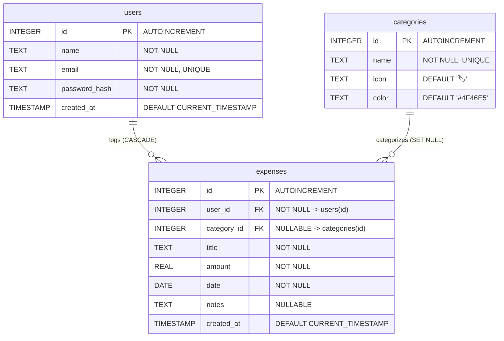

# Implementation Plan: Step 1 — Database Setup (`database/db.py` & `app.py`)

## Goal Description
Implement the core database layer for the **Spendly** expense tracker application using SQLite3, Python 3.13, and Flask 3.x. This foundational step establishes connection handling, schema creation, database lifecycle hooks, default seeding (categories, demo user, and sample transactions), and comprehensive automated testing.

---

## Architecture & Schema Overview



---

## User Review Required

> [!IMPORTANT]
> - **Flask CLI Commands**: We will register `init-db` and `seed-db` Flask CLI commands via `database.db.init_app(app)` in addition to the standalone script execution (`python database/db.py`).
> - **Test Database Isolation**: Tests will use temporary / isolated SQLite databases via pytest fixtures (`tmp_path`) and `app.config['DATABASE']` without altering `database/spendly.db`.

---

## Proposed Changes

### Database Layer

#### [MODIFY] `database/db.py`
- Enhance `get_db()`:
  - Check `flask.has_app_context()`. If inside app context, retrieve database path from `current_app.config.get('DATABASE', DB_PATH)` and cache connection in `g.db`.
  - Outside app context, return direct connection with `PRAGMA foreign_keys = ON;` and `row_factory = sqlite3.Row`.
- Enhance `close_db(e=None)`:
  - Gracefully close connection stored in `g.db`.
- Enhance `init_db(conn=None)`:
  - Execute DDL for `users`, `categories`, and `expenses` tables using `CREATE TABLE IF NOT EXISTS`.
  - Set up cascade rules: `ON DELETE CASCADE` for `expenses.user_id` and `ON DELETE SET NULL` for `expenses.category_id`.
- Enhance `seed_db(conn=None)`:
  - Insert default categories (`Food & Dining`, `Groceries`, `Transportation`, `Shopping`, `Housing & Rent`, `Bills & Utilities`, `Entertainment`, `Healthcare`, `Education`, `Miscellaneous`) with icons and hex colors.
  - Insert demo user (`Nitish Kumar`, `nitish@example.com`, hashed password for `password123` via `werkzeug.security.generate_password_hash`).
  - Insert initial sample expenses for the demo user if not already present.
- Add `init_app(app)`:
  - Register `close_db` with `app.teardown_appcontext`.
  - Register `flask init-db` and `flask seed-db` CLI commands.

---

### Application Layer

#### [MODIFY] `app.py`
- Import `database.db.init_app`.
- Call `init_app(app)` to bind database context teardown and CLI commands to the Flask application.

---

### Test Suite

#### [NEW] `tests/conftest.py`
- Define pytest fixtures for `app`, `client`, `runner`, and temporary database setup (`tmp_path`).

#### [NEW] `tests/test_db.py`
- `test_get_close_db`: Verify `get_db` returns the same connection in context and `close_db` closes it.
- `test_foreign_keys_enabled`: Verify SQLite foreign key enforcement is active.
- `test_init_db_creates_tables`: Verify all three tables (`users`, `categories`, `expenses`) and their schema.
- `test_seed_db`: Verify categories, demo user, password hash validity (`check_password_hash`), and sample expenses.
- `test_seed_db_idempotency`: Verify multiple calls to `seed_db` do not create duplicate users or categories.
- `test_foreign_key_cascade_and_set_null`: Verify cascade deletion on user delete and nullification on category delete.
- `test_cli_commands`: Verify `flask init-db` and `flask seed-db` execute successfully via CLI runner.

---

## Verification Plan

### Automated Tests
```bash
pytest -v
```

### Manual Verification
1. Run database initialization and seeding script:
   ```bash
   python database/db.py
   ```
2. Inspect database schema and rows:
   ```bash
   sqlite3 database/spendly.db ".tables"
   sqlite3 database/spendly.db "SELECT id, name, email FROM users;"
   sqlite3 database/spendly.db "SELECT id, name, icon, color FROM categories;"
   sqlite3 database/spendly.db "SELECT id, title, amount, date FROM expenses;"
   ```
3. Test Flask CLI commands:
   ```bash
   flask --app app init-db
   flask --app app seed-db
   ```
